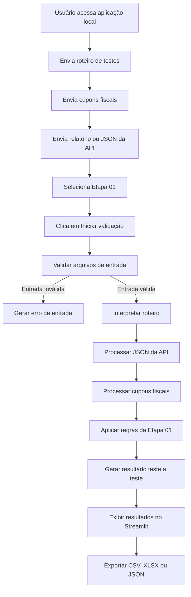

# Documento de Design de Software (DDS) — DIKE- 

## 1. Visão geral e objetivos

| Item | Descrição |
|------|-----------|
| **Nome do projeto** | Dike — Automação API 3.0 (Etapa 01: Sell-out) |
| **Problema** | A validação manual de roteiros de testes, cupons fiscais (JPEG, PDF ou XML) e JSON da API interna consome entre 30 minutos e 2 horas por etapa, com risco relevante de erro humano. |
| **Objetivo da automação** | Ler o roteiro de testes, comparar seu conteúdo com os cupons enviados e validar o JSON da API, gerando um log detalhado (Sucesso/Falha, motivo principal, motivo detalhado e tipo de falha) em até 5 minutos por execução. |
| **Critérios de sucesso** | • Cobertura de 100% dos cupons informados no roteiro<br>• Redução drástica do tempo de validação manual<br>• Confiabilidade de 100% nas validações, atestada por double-check manual inicial<br>• Estrutura de validação exata, auditável e repetível entre execuções |

---

## 2. Escopo por etapas (roadmap)

- **Etapa 01 (MVP):** Validação de sell-out, sem regras de promoção. Foco em funcionamento ponta a ponta: upload de documentos, leitura do roteiro, validação cupom a cupom, validação do JSON e exportação do log.
- **Etapa 02:** Inclusão de regras de promoção nos escopos "Com BIN" (59 testes) e "Sem BIN" (38 testes).
- **Etapa 03:** Escopos "Com BIN" (32 testes) e "Sem BIN" (18 testes), com regras avançadas de promoção.

> **Regra:** Cada etapa deve ser desenvolvida e validada sequencialmente. A Etapa 01 precisa estar funcional e homologada antes de iniciar a Etapa 02.

---

## 3. Arquitetura da solução

**Tipo de aplicação:** Ferramenta local (desktop ou web local) em Python, com interface simples para upload de documentos e execução da validação sob demanda.

**Componentes principais:**

- **Interface de upload:** Seleção separada de arquivos — roteiro (XLSX/CSV), cupons (JPEG/PDF/XML) e JSON da API. A nomeação individual de cada campo de anexo será definida em etapa posterior.
- **Parser de roteiro:** Leitura da planilha de testes, mapeando teste → cupom esperado → regras aplicáveis.
- **Parser de cupons:** Extração de dados via OCR (JPEG/PDF) e parsing direto (XML).
- **Validador de JSON:** Comparação do JSON enviado à API com o schema e valores esperados.
- **Motor de regras:** Aplicação das regras de validação (campos obrigatórios, valores, consistência).
- **Gerador de log:** Saída estruturada por teste (Sucesso/Falha, motivo principal, motivo detalhado, tipo de falha).
- **Exportador:** Log em CSV/JSON e relatório resumido em HTML ou Markdown.

---

## 4. Fluxo de execução (Etapa 01)

1. O usuário envia os arquivos de entrada:
   - Roteiro de testes (XLSX/CSV) com as colunas `ID_teste`, `cupom_esperado`, `regras` e `observações`.
   - Um ou mais cupons (JPEG/PDF/XML).
   - JSON exportado da API 3.0 (Movimentos e Promoções).
2. O usuário aciona o botão **"Iniciar validação"**.
3. O sistema processa a solicitação:
   - Lê o roteiro e identifica os testes a validar, cruzando o valor informado na coluna específica da planilha com o campo numérico do JSON e localizando esse mesmo número no cupom impresso.
   - Para cada teste, localiza o cupom correspondente (por nome ou ID) e extrai os dados.
   - Valida o JSON da API conforme o schema esperado.
   - Aplica as regras de validação (campos obrigatórios, valores, consistência).
4. O sistema gera, para cada teste, um log detalhado contendo:
   - Sucesso (S/N).
   - Motivo principal (ex.: "Campo ausente", "Valor divergente", "XML inválido").
   - Motivo detalhado (ex.: "Campo `total` esperado 100.00, encontrado 99.90").
   - Tipo de falha (leve, mediana, grave, gravíssima ou impossível validar/erro 400).
5. O sistema exporta o log (CSV/JSON) e um relatório resumido (HTML/Markdown).

---

## 5. Regras de validação (Etapa 01 — sell-out)

Com a análise do `docDike.pdf` (API Movimentos e Promoções, v2.1), já é possível confirmar parte das regras abaixo com base na documentação oficial; os exemplos marcados como "a confirmar" ainda dependem do roteiro de testes e dos cupons reais.

### Confirmado pela documentação da API:

- **Campos obrigatórios** no corpo da venda (`POST .../movimientos`): `fecha` (ISO 8601), `numero`, `descuentoTotal`, `recargoTotal`, `codigoMoneda` (valor fixo 986), `cotizacion` (valor fixo 1.00), `total`, `cancelacion`, além dos arrays `detalles` e `pagos`.
- **Formato numérico:** Valores de venda (total, descontos, acréscimos) devem ter exatamente 2 casas decimais; `importeUnitario` pode ter até 4 casas decimais.
- **Regra de cancelamento:** O cupom cancelado reutiliza o mesmo `numero` do cupom original, precedido de hífen (ex.: `-0358`); o cupom original deve ser enviado com `cancelacion: false` e o cancelado com `cancelacion: true`.
- **Regra do array `detalles`:** Cada item deve conter `codigoArticulo`, `codigoBarras`, `descripcionArticulo`, `cantidad`, `importeUnitario` e `importe`.
- **Regra do array `pagos`:** Cada forma de pagamento deve informar `codigoTipoPago` (9 Efetivo, 10 Crédito, 11 Cheque, 12 Vale/Voucher, 13 Débito, 14 QR, 15 Finalizadora); quando aplicável a promoções por cartão, também `bin` e `ultimosDigitosTarjeta`.

### A confirmar com roteiro e cupons reais:

- Correspondência exata entre o campo numérico do JSON e o número impresso no cupom (regra de negócio específica do parceiro).
- Existência do cupom informado no roteiro dentre os arquivos enviados.
- Validação estrutural de XML (boa formação e presença de campos fiscais obrigatórios), conforme padrão do parceiro.

---

## 6. Tecnologias e bibliotecas sugeridas (Python)

| Necessidade | Solução proposta |
|-------------|------------------|
| Interface local | Streamlit (definido como escolha final — ver seção 12) |
| Leitura de planilhas | `pandas` + `openpyxl` (XLSX), `csv` (CSV) |
| OCR para JPEG/PDF | `pytesseract` + `Pillow` (imagens); `pdf2image` + `pytesseract` (PDF) |
| Parsing de XML | `xml.etree.ElementTree` ou `lxml` |
| Validação de JSON | `jsonschema` (schema), `json` (parsing) |
| Geração de log | `logging` + `pandas` (exportação CSV), `markdown` (relatório) |

---

## 7. Estrutura de dados (exemplos)

**Roteiro (XLSX/CSV):**

```csv
ID_teste,cupom_esperado,regras,observacoes
T001,cupom_001.json,"campos_obrigatorios;valor_total","sell-out basico"
T002,cupom_002.pdf,"campos_obrigatorios;valor_total","sell-out basico"
```

**Log de saída (CSV):**

```csv
ID_teste,Sucesso,Motivo_principal,Motivo_detalhado,Tipo_falha
T001,S,,,
T002,N,Campo ausente,"Campo 'total' esperado 100.00, encontrado 99.90",mediana
```

---

## 8. Tratamento de erros e retry

- **Retry:** Até 3 tentativas para falhas transitórias (ex.: falha de OCR, arquivo corrompido).
- **Notificação:** Após 3 falhas consecutivas, registrar no log como "impossível validar (erro 400)" e seguir para o próximo teste.
- **Observabilidade:** Log detalhado por teste, com timestamp e versão da rotina de validação utilizada.

---

## 9. Critérios de aceitação (Etapa 01)

- **Cobertura:** 100% dos cupons enviados são validados.
- **Tempo:** Execução completa em até 5 minutos, para o volume previsto na Etapa 01.
- **Confiabilidade:** 100% de acerto nas validações, confirmado por double-check manual inicial.
- **Estrutura:** Log exportado contendo todos os campos definidos (Sucesso, motivo principal, motivo detalhado, tipo de falha).

---

## 10. Riscos e mitigações

| Risco | Mitigação |
|-------|-----------|
| OCR impreciso em JPEG/PDF de baixa qualidade | Retry automático + validação manual dos casos críticos |
| Mudança no layout do JSON ou XML | Versionamento do schema e atualização do validador |
| Roteiro de testes desatualizado | Validação da estrutura do roteiro antes do processamento |

---

## 11. Plano de implementação (Etapa 01)

### Semana 1
- Configurar ambiente Python e bibliotecas.
- Implementar parser de roteiro (XLSX/CSV).
- Implementar parser de JSON e validação de schema.

### Semana 2
- Implementar parser de XML.
- Implementar OCR para JPEG/PDF.
- Implementar motor de regras da Etapa 01.

### Semana 3
- Implementar interface de upload e botão "Iniciar".
- Implementar gerador de log e exportação.
- Realizar testes internos e double-check manual.

### Semana 4
- Ajustes finais e validação com o gestor.
- Documentação de uso e handover.

---

## 12. Próximos passos (ações imediatas)

### 12.1 Documentação da API

**Status:** O arquivo `docDike.pdf` (API Movimentos e Promoções, versão 2.1) já foi recebido e analisado.

**Principais achados já mapeados:**
- Endpoints de vendas (`POST .../movimientos`, alta e consulta em lote via `movimientoslotes`) e de promoções (`promocionesConLimitePorTicket` e `v2/.../promociones`), com ambientes distintos de homologação e produção.
- Campos obrigatórios e opcionais do corpo de venda, incluindo os arrays `detalles` e `pagos`.
- Regras de formatação (datas em ISO 8601, valores com 2 ou 4 casas decimais conforme o campo).
- Regras específicas de Promoção por Meio de Pagamento (BIN): validação por `codigoTipoPago`, array `formasPago`, ordem obrigatória de validação e rotina de rollback em falha de TEF — aplicáveis às Etapas 02 e 03.
- Não foram localizados, até o momento, exemplos de códigos de retorno HTTP (incluindo o erro 400) dentro do PDF analisado; esse ponto segue como pendência de esclarecimento junto à área responsável.

**Pendências remanescentes:**
- Definir quais campos do JSON devem ser comparados diretamente com o cupom fiscal impresso.
- Separar formalmente, em um documento de regras, o que se aplica à Etapa 01 do que se aplica às Etapas 02 e 03.
- Confirmar os códigos de retorno HTTP e o tratamento esperado para erro 400.

### 12.2 Arquivos de entrada ainda indisponíveis

Continuam pendentes:
- Roteiro de testes real, em XLSX ou CSV.
- Cupom fiscal real (XML, PDF ou JPEG), anonimizado.
- JSON real exportado da API interna.

A ausência desses arquivos não impede a preparação da arquitetura, mas impede a implementação definitiva dos parsers e das regras de negócio. A primeira versão deve trabalhar com dados simulados e contratos de entrada provisórios, substituídos assim que os arquivos reais estiverem disponíveis.

### 12.3 Decisão tecnológica

A aplicação será desenvolvida em Python com Streamlit, executada localmente na máquina do usuário.

**Justificativa:**

| Necessidade | Solução proposta |
|-------------|------------------|
| Interface simples | Streamlit |
| Upload de múltiplos documentos | `st.file_uploader` |
| Execução manual | Botão "Iniciar validação" |
| Visualização dos resultados | Tabela interativa |
| Exportação de logs | CSV, XLSX e JSON |
| Execução local | `streamlit run app.py` |
| Evolução futura | Separação entre interface, parsers e motor de regras |

O Streamlit é adequado ao MVP por permitir criar rapidamente uma interface funcional sem exigir conhecimento de desenvolvimento frontend. A interface, no entanto, não deve conter regras de negócio diretamente; elas ficam isoladas em módulos independentes, facilitando testes e evolução futura.

### 12.4 Arquitetura inicial de diretórios

```
Dike/
├── Dike.py
├── requirements.txt
├── README.md
├── logs/
├── documentacao/
├── versions/
├── config/
│   ├── settings.py
│   └── schema_etapa01.json
├── data/
│   ├── exemplos/
│   └── temporarios/
├── src/
│   ├── models/
│   │   ├── resultado_validacao.py
│   │   └── entrada_validacao.py
│   ├── parsers/
│   │   ├── roteiro_parser.py
│   │   ├── json_parser.py
│   │   ├── xml_parser.py
│   │   ├── pdf_parser.py
│   │   └── imagem_parser.py
│   ├── validators/
│   │   ├── validador_geral.py
│   │   ├── validador_etapa01.py
│   │   └── regras.py
│   ├── services/
│   │   ├── processamento.py
│   │   ├── exportacao.py
│   │   └── retry.py
│   └── utils/
│       ├── arquivos.py
│       ├── normalizacao.py
│       └── logs.py
└── tests/
    ├── test_parsers.py
    ├── test_validador_etapa01.py
    └── fixtures/
```

### 12.5 Fluxo da aplicação



### 12.6 Entradas do MVP

Enquanto os arquivos reais não estiverem disponíveis, a primeira implementação deve aceitar os formatos abaixo de maneira controlada.

**Roteiro**

Formatos planejados: `.xlsx`, `.csv`.

Estrutura provisória:

| Coluna | Obrigatória | Finalidade |
|--------|-------------|------------|
| `id_teste` | Sim | Identificar o teste |
| `descricao` | Sim | Descrever o cenário |
| `cupom_referencia` | Sim | Relacionar o teste ao cupom |
| `tipo_validacao` | Sim | Indicar a validação esperada |
| `observacao` | Não | Registrar informações adicionais |

> Essa estrutura é provisória; os nomes definitivos devem respeitar o formato real utilizado pelo parceiro.

**Cupons fiscais**

Formatos planejados, em ordem de prioridade técnica:
1. XML (leitura estrutural direta).
2. PDF com texto selecionável.
3. PDF escaneado (requer OCR).
4. JPEG (requer OCR).

> O XML deve ser tratado como fonte mais confiável quando disponível, pois permite leitura estruturada dos campos sem depender de reconhecimento óptico.

**Dados da API**

O sistema deve aceitar inicialmente:
- Arquivo `.json`.
- Arquivo `.xlsx` exportado pela API interna.
- Arquivo `.csv`, caso o relatório seja exportado nesse formato.

A aplicação deve identificar automaticamente o tipo do arquivo e encaminhá-lo ao parser correspondente.

### 12.7 Resultado por teste

Cada teste deve produzir uma estrutura semelhante à seguinte.

**Caso de sucesso:**

```json
{
  "id_teste": "T001",
  "sucesso": "S",
  "motivo_principal": null,
  "motivo_detalhado": null,
  "tipo_falha": null,
  "arquivo_cupom": "cupom_001.xml",
  "arquivo_api": "relatorio_api.json",
  "etapa": "01",
  "tentativas": 1
}
```

**Caso de falha:**

```json
{
  "id_teste": "T002",
  "sucesso": "N",
  "motivo_principal": "Divergência de valor",
  "motivo_detalhado": "O valor esperado no roteiro era 150.00, mas o valor encontrado no cupom foi 145.00.",
  "tipo_falha": "mediana",
  "arquivo_cupom": "cupom_002.pdf",
  "arquivo_api": "relatorio_api.xlsx",
  "etapa": "01",
  "tentativas": 1
}
```

### 12.8 Classificação de falhas

| Tipo | Aplicação inicial |
|------|-------------------|
| Leve | Divergência sem impacto funcional relevante, ou campo opcional inconsistente |
| Mediana | Divergência em campo importante, mas com possibilidade de análise |
| Grave | Falha que compromete o cenário ou o resultado da integração |
| Gravíssima | Falha que invalida o fluxo, gera risco fiscal ou impede a continuidade da homologação |
| Impossível validar | Arquivo ilegível, estrutura inválida, ausência de dados essenciais ou erro equivalente ao HTTP 400 |

> Essa classificação deve ser ajustada após a análise final da documentação da API e do roteiro real.

### 12.9 Estratégia sem arquivos reais

Enquanto os arquivos reais não estiverem disponíveis, o desenvolvimento pode avançar em quatro frentes paralelas:
1. Construir a interface Streamlit.
2. Definir os contratos de entrada e saída.
3. Implementar os parsers com arquivos simulados.
4. Criar testes unitários para casos de sucesso, falha e arquivo inválido.

> Dados simulados não devem ser usados para declarar a automação como homologada — servem apenas para validar a estrutura técnica da aplicação.

**Massa de dados simulados mínima:**
- Um teste aprovado.
- Um teste com campo ausente.
- Um teste com valor divergente.
- Um XML inválido.
- Um PDF sem texto.
- Uma imagem ilegível.
- Um JSON com estrutura inesperada.
- Um caso com erro equivalente a HTTP 400.
- Um caso em que o cupom indicado no roteiro não foi enviado.

### 12.10 Critério para iniciar a implementação definitiva

A implementação das regras reais da Etapa 01 deve começar somente após a obtenção de, no mínimo:
- `docDike.pdf` (já recebido e analisado).
- Um roteiro real anonimizado.
- Um cupom real anonimizado.
- Um JSON ou relatório real exportado da API.

---

## Interface — Wireframe Conceitual

```
+--------------------------------------------------------------------------------+
|  [Sidebar (expansível)]                 | [Conteúdo Principal]                        |
|                                         |                                                   |
|  ⚙️ CONFIGURAÇÕES          | 🚀 DIKE - AUTOMAÇÃO API 3.0                      |
|                                         | Validador de Sell-Out e Promoções                 |
|  Etapa de Validação:       |                                                   |
|  (x) Etapa 01              | --- 1. ENTRADA DE DADOS ----------------------    |
|  ( ) Etapa 02              | [Col 1]            [Col 2]           [Col 3]      |
|    ( )Com BIN              |                                                   |
|    ( )Sem BIN              |                                                   |
|  ( ) Etapa 03 (Avançado)   | 📄 Roteiro         🧾 Cupons         🧩 API JSON |
|    ( )Com BIN              |                                                   |
|    ( )Sem BIN              | [Upload XLSX/CSV]  [Upload PDF/XML]  [Upload]     |
|                                         |                                                   |
|  Logs e Debug:             | --- 2. EXECUÇÃO ------------------------------    |
|  [x] Modo Verboso          | [ INICIAR VALIDAÇÃO ]                             |
|                                         | (Barra de progresso e status: Validando T001)     |
|  Instruções:               |                                                   |
|  - Anexe todos os arquivos | --- 3. RESULTADOS ----------------------------    |
|  - Execute o validador     | 📊 Resumo: 100 Testes | 90 S | 10 N               |
|  - Gere o log de resultado |                                                   |
|                                         | [ Tabela Interativa com Filtros ]                 |
|                                         | ID_Teste | Sucesso | Motivo | Arquivos            |
|                                         |                                                   |
|                                         | ⬇️ [Exportar CSV] ⬇️ [Exportar JSON]             |
+--------------------------------------------------------------------------------+
```