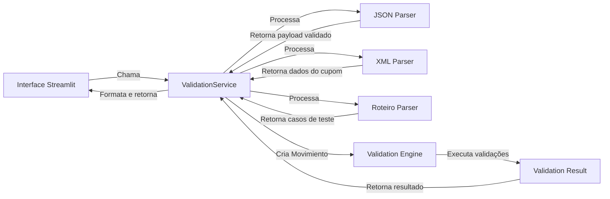

# Fluxo do Processo de Validação

Este documento descreve o fluxo completo do processo de validação no projeto Dikē, desde o upload dos arquivos até a geração dos resultados.

## Fluxo Geral

```mermaid
flowchart TD
    A[Início: Upload de Arquivos] --> B[Processar Roteiro de Testes]
    A --> C[Processar Cupons Fiscais]
    A --> D[Processar JSON da API]
    
    B --> E[Extrair Casos de Teste]
    C --> F[Extrair Dados dos Cupons]
    D --> G[Extrair Payload da API]
    
    E --> H[Para cada Caso de Teste:]
    F --> H
    G --> H
    
    H --> I[Encontrar Cupom Correspondente]
    I --> J[Criar Objeto Movimiento]
    J --> K[Validar Movimiento com ValidationEngine]
    
    K --> L{ValidationEngine: validar_movimiento()}
    L --> M[Validação de Campos Obrigatórios]
    L --> N[Validação de Detalhes]
    L --> O[Validação de Pagamentos]
    L --> P[Consistência Total-Detalhes]
    L --> Q[Consistência Total-Pagamentos]
    L --> R[Validação de Desconto/Recargo]
    
    M --> S[Adicionar Erros/Avisos se necessário]
    N --> S
    O --> S
    P --> S
    Q --> S
    R --> S
    
    S --> T[Retornar ValidationResult]
    T --> U[Formatar Resultados para Exibição]
    U --> V[Fim: Exibir Relatórios de Validação]
```

## Detalhamento das Etapas de Validação

### 1. Validação de Campos Obrigatórios
- Verifica se `numero` está presente e não vazio
- Verifica se `total` não é negativo (exceto para movimentos cancelados explícitos)

### 2. Validação de Detalhes
- Verifica se a lista de detalhes não está vazia (aviso se vazia)
- Para cada detalhe, verifica se o data não está vazio (aviso se vazio)

### 3. Validação de Pagamentos
- Verifica se há pelo menos um pagamento (erro se vazia)
- Para cada pagamento, verifica se o data não está vazio (aviso se vazio)

### 4. Consistência Total-Detalhes
- Calcula: `total_esperado = soma(detalhes) - desconto_total + recargo_total`
- Compara com o campo `total` do movimento (tolerância de 0.01)
- Adiciona erro se a diferença for maior que a tolerância

### 5. Consistência Total-Pagamentos
- Calcula: `soma_pagos = soma(valor de cada pagamento)`
- Compara com o campo `total` do movimento (tolerância de 0.01)
- Adiciona erro se a diferença for maior que a tolerância

### 6. Validação de Desconto/Recargo
- Verifica se desconto_total e recargo_total não são negativos
- Para movimentos não cancelados, verifica se desconto não é maior que o total estimado dos detalhes (aviso se for)

## Fluxo de Dados entre Módulos



## Pontos de Extensão

1. **Novos tipos de arquivos de cupom**: Adicionar parsers em `src/parsers/` e atualizar `_processar_cupons` em `validation_service.py`
2. **Novas regras de validação**: Adicionar métodos privados em `ValidationEngine` e chamá-los de `validar_movimiento`
3. **Novos formatos de roteiro**: Estender `RoteiroParser` ou criar novos parsers
4. **Saída de resultados diferentes**: Modificar a formatação em `validar_arquivos` ou criar novos formatadores